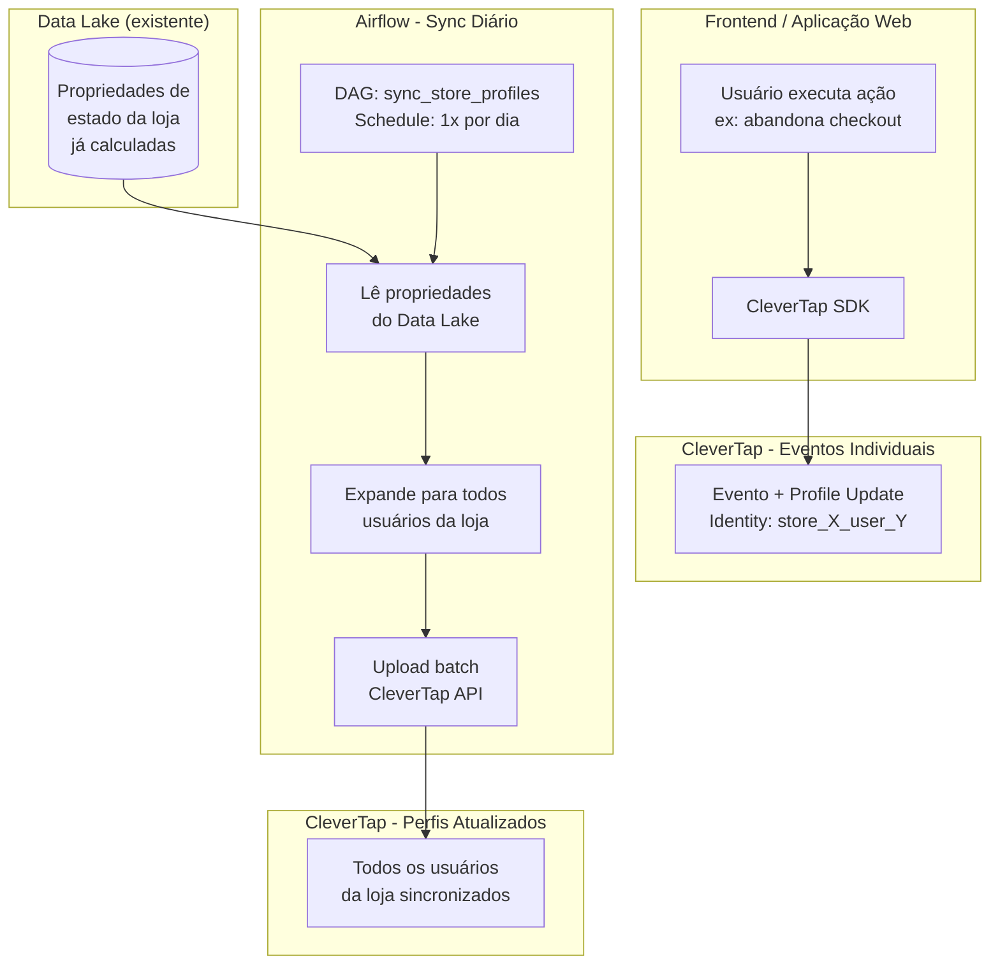
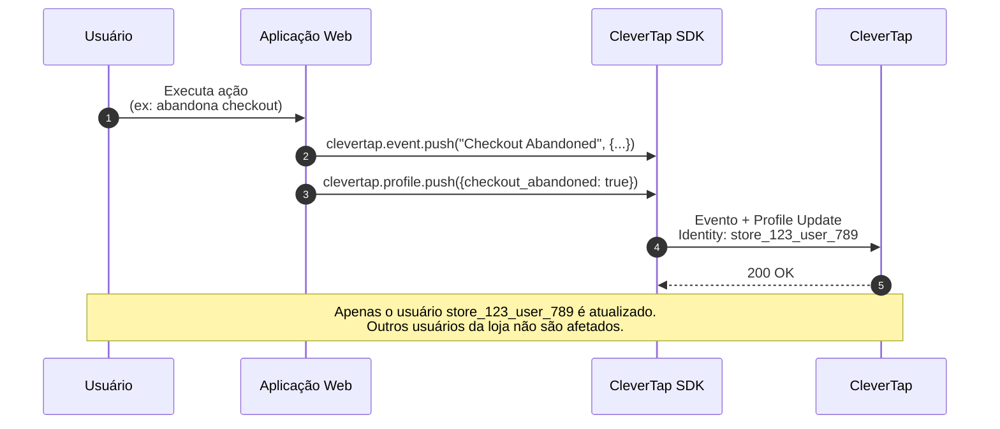
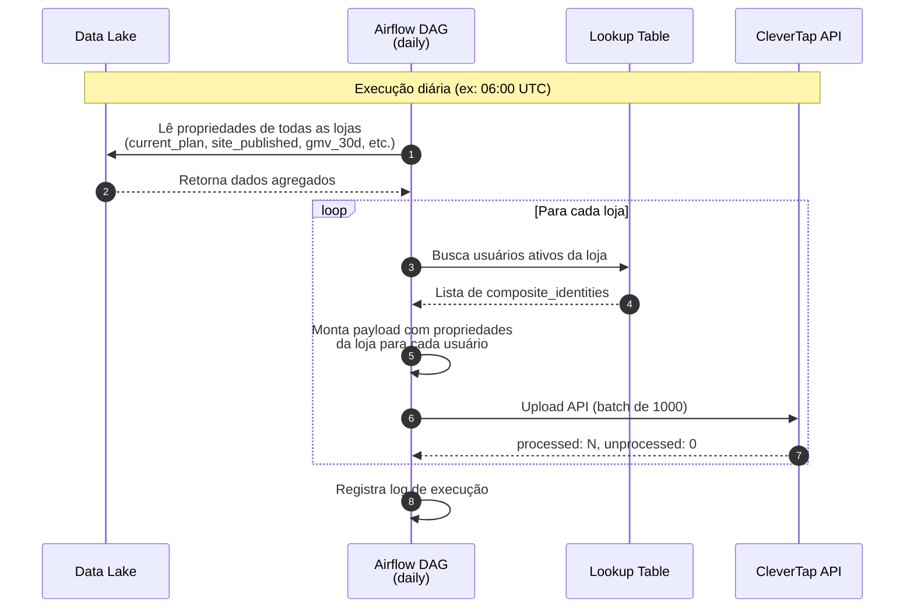
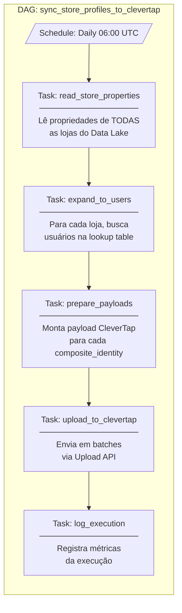
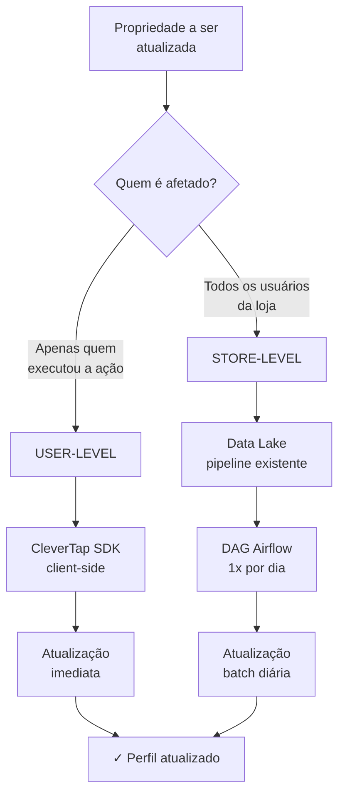
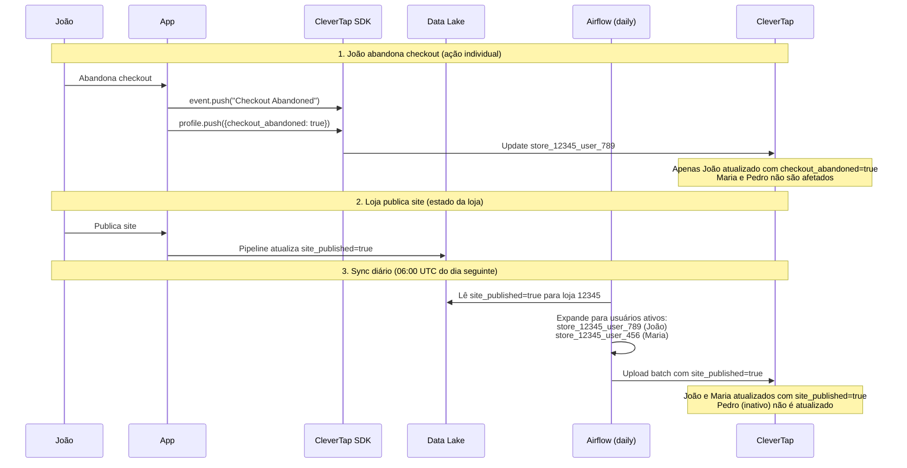

# User Identity Sync Flow - Loja Integrada

**Versão:** 2.0
**Data:** 09 de Fevereiro de 2026
**Plataforma:** CleverTap + Airflow

---

## Visão Geral

Este documento descreve a estratégia de sincronização de propriedades entre lojas e usuários no CleverTap.

**Princípios:**

1. **Eventos client-side (CleverTap SDK)**: Enviados apenas para o usuário que executou a ação
2. **Propriedades de estado da loja**: Sincronizadas via DAG diária do Airflow, atualizando todos os usuários da loja
3. **Pipeline backend → lake**: Já existe e não será representado neste documento

---

## Diagrama de Arquitetura



---

## Fluxo de Eventos Client-Side

Eventos disparados pelo usuário são enviados **apenas para quem executou a ação**.



---

## Fluxo de Sincronização Diária (Store-Level)

Propriedades de estado da loja são sincronizadas **1x por dia** via Airflow.



---

## Diagrama da DAG Airflow



---

## Pseudo-código da DAG

```python
# DAG: sync_store_profiles_to_clevertap.py

from airflow import DAG
from airflow.operators.python import PythonOperator
from datetime import datetime, timedelta

default_args = {
    'owner': 'data-team',
    'depends_on_past': False,
    'retries': 3,
    'retry_delay': timedelta(minutes=5),
}

dag = DAG(
    'sync_store_profiles_to_clevertap',
    default_args=default_args,
    description='Sincroniza propriedades de loja para todos os usuários no CleverTap',
    schedule_interval='0 6 * * *',  # Diariamente às 06:00 UTC
    catchup=False,
)


def read_store_properties(**context):
    """
    Lê propriedades de estado de TODAS as lojas do Data Lake.
    Dados já calculados pelo pipeline existente.
    """
    stores = query_data_lake("""
        SELECT
            store_id,
            -- Plano e assinatura
            current_plan,
            plan_start_date,
            billing_cycle,
            is_paying_customer,
            -- Komea / Site
            site_published,
            -- Enviali (BC1/BC2)
            enviali_active,
            shipping_methods_active,
            correios_direct_contract,
            enviali_balance_amount,
            -- Loggi (BC3)
            loggi_active,
            -- Pagali (BC6)
            pagali_account_status,
            payment_methods_configured,
            mercado_pago_configured,
            -- Produtos (BC5)
            has_products,
            -- Marketplace (BC11)
            mercado_livre_connected,
            -- Fiscal (BC10)
            nfe_configured,
            tax_regime,
            -- Métricas agregadas
            gmv_30d,
            visitas_30d,
            qtde_pedido_30d
        FROM store_profiles_daily
        WHERE snapshot_date = CURRENT_DATE
    """)

    return stores


def expand_to_users(**context):
    """
    Para cada loja, busca todos os usuários ativos.
    Retorna lista de (composite_identity, store_properties).
    """
    stores = context['ti'].xcom_pull(task_ids='read_store_properties')

    expanded = []
    for store in stores:
        store_id = store['store_id']

        # Busca usuários ativos desta loja
        users = query_database(f"""
            SELECT composite_identity
            FROM store_users
            WHERE store_id = {store_id}
              AND is_active = true
        """)

        # Expande: cada usuário recebe as propriedades da loja
        for user in users:
            expanded.append({
                'composite_identity': user['composite_identity'],
                'properties': store  # todas as propriedades da loja
            })

    return expanded


def prepare_payloads(**context):
    """
    Monta payloads no formato CleverTap Upload API.
    """
    expanded = context['ti'].xcom_pull(task_ids='expand_to_users')

    payloads = []
    for item in expanded:
        payload = {
            "identity": item['composite_identity'],
            "type": "profile",
            "profileData": {
                # Plano e assinatura
                "current_plan": item['properties']['current_plan'],
                "plan_start_date": item['properties']['plan_start_date'],
                "billing_cycle": item['properties']['billing_cycle'],
                "is_paying_customer": item['properties']['is_paying_customer'],
                # Komea / Site
                "site_published": item['properties']['site_published'],
                # Enviali (BC1/BC2)
                "enviali_active": item['properties']['enviali_active'],
                "shipping_methods_active": item['properties']['shipping_methods_active'],
                "correios_direct_contract": item['properties']['correios_direct_contract'],
                "enviali_balance_amount": item['properties']['enviali_balance_amount'],
                # Loggi (BC3)
                "loggi_active": item['properties']['loggi_active'],
                # Pagali (BC6)
                "pagali_account_status": item['properties']['pagali_account_status'],
                "payment_methods_configured": item['properties']['payment_methods_configured'],
                "mercado_pago_configured": item['properties']['mercado_pago_configured'],
                # Produtos (BC5)
                "has_products": item['properties']['has_products'],
                # Marketplace (BC11)
                "mercado_livre_connected": item['properties']['mercado_livre_connected'],
                # Fiscal (BC10)
                "nfe_configured": item['properties']['nfe_configured'],
                "tax_regime": item['properties']['tax_regime'],
                # Métricas agregadas
                "gmv_30d": item['properties']['gmv_30d'],
                "visitas_30d": item['properties']['visitas_30d'],
                "qtde_pedido_30d": item['properties']['qtde_pedido_30d'],
            }
        }
        payloads.append(payload)

    return payloads


def upload_to_clevertap(**context):
    """
    Envia batch de perfis para CleverTap via Upload API.
    """
    payloads = context['ti'].xcom_pull(task_ids='prepare_payloads')

    BATCH_SIZE = 1000
    results = {'total': len(payloads), 'processed': 0, 'unprocessed': 0}

    for i in range(0, len(payloads), BATCH_SIZE):
        batch = payloads[i:i + BATCH_SIZE]

        response = clevertap_api.upload_profiles(
            account_id=CLEVERTAP_ACCOUNT_ID,
            passcode=CLEVERTAP_PASSCODE,
            data={"d": batch}
        )

        results['processed'] += response.json().get('processed', 0)
        results['unprocessed'] += response.json().get('unprocessed', 0)

    return results


def log_execution(**context):
    """
    Registra métricas da execução.
    """
    results = context['ti'].xcom_pull(task_ids='upload_to_clevertap')

    insert_log(
        execution_date=context['ds'],
        total_profiles=results['total'],
        processed=results['processed'],
        unprocessed=results['unprocessed'],
        status='success' if results['unprocessed'] == 0 else 'partial'
    )


# Definição das tasks
t1 = PythonOperator(task_id='read_store_properties', python_callable=read_store_properties, dag=dag)
t2 = PythonOperator(task_id='expand_to_users', python_callable=expand_to_users, dag=dag)
t3 = PythonOperator(task_id='prepare_payloads', python_callable=prepare_payloads, dag=dag)
t4 = PythonOperator(task_id='upload_to_clevertap', python_callable=upload_to_clevertap, dag=dag)
t5 = PythonOperator(task_id='log_execution', python_callable=log_execution, dag=dag)

# Dependências
t1 >> t2 >> t3 >> t4 >> t5
```

---

## Fluxo de Decisão: Onde Atualizar



---

## Classificação de Propriedades

### STORE-LEVEL (Sync diário via Airflow)

Propriedades que representam o **estado da loja** e devem ser iguais para todos os usuários.

| Propriedade                  | Descrição                      |
| ---------------------------- | ------------------------------ |
| `current_plan`               | Plano atual da loja            |
| `plan_start_date`            | Data de início do plano        |
| `billing_cycle`              | Ciclo de cobrança              |
| `is_paying_customer`         | Se é cliente pagante           |
| `site_published`             | Se o site está publicado       |
| `enviali_active`             | Se Enviali está ativo          |
| `shipping_methods_active`    | Lista de métodos ativos        |
| `correios_direct_contract`   | Contrato direto Correios       |
| `enviali_balance_amount`     | Saldo Enviali                  |
| `loggi_active`               | Se Loggi está ativa            |
| `pagali_account_status`      | Status do Pagali               |
| `payment_methods_configured` | Meios de pagamento ativos      |
| `mercado_pago_configured`    | Se Mercado Pago está config.   |
| `has_products`               | Se tem produtos cadastrados    |
| `mercado_livre_connected`    | Se ML está conectado           |
| `nfe_configured`             | Se NF está configurada         |
| `tax_regime`                 | Regime tributário              |
| `gmv_30d`                    | GMV últimos 30 dias            |
| `visitas_30d`                | Visitas últimos 30 dias        |
| `qtde_pedido_30d`            | Pedidos últimos 30 dias        |

### USER-LEVEL (Eventos client-side)

Propriedades que representam **ações individuais** do usuário.

| Propriedade              | Evento que dispara          |
| ------------------------ | --------------------------- |
| `komea_access_count`     | Usuário acessa Komea        |
| `komea_last_access_date` | Último acesso à Komea       |
| `MSG-email`, `MSG-push`  | Usuário altera preferências |

### DUAL-WRITE (Frontend + Backend diário)

Propriedades de assinatura são atualizadas em dois momentos:

1. **Imediato (Frontend):** Quando o usuário completa `Subscription Completed`, o SDK atualiza o perfil DESTE usuário
2. **Diário (Backend):** O DAG sincroniza para TODOS os usuários da loja

| Propriedade          | Evento Frontend          |
| -------------------- | ------------------------ |
| `current_plan`       | `Subscription Completed` |
| `billing_cycle`      | `Subscription Completed` |
| `is_paying_customer` | `Subscription Completed` |

> Nota: Entre o update frontend e o sync diário, outros usuários da mesma loja podem ter dados desatualizados (até 24h).
>
> **Nota sobre Inaction:** Propriedades de abandono (`checkout_abandoned`, `checkout_abandoned_step`, `pagali_abandoned_step`) foram removidas. Fluxos de abandono devem usar **segmentação Inaction no CleverTap** (ex: evento de início "Did" AND evento de conclusão "Did not" nos últimos X dias).

---

## Modelo de Dados: Lookup Table

### Tabela: `store_users`

Relacionamento entre lojas e usuários para expansão no sync diário.

```sql
CREATE TABLE store_users (
    id SERIAL PRIMARY KEY,
    store_id BIGINT NOT NULL,
    user_id BIGINT NOT NULL,
    composite_identity VARCHAR(100) GENERATED ALWAYS AS (
        'store_' || store_id || '_user_' || user_id
    ) STORED,
    role VARCHAR(20) NOT NULL DEFAULT 'viewer',
    is_active BOOLEAN NOT NULL DEFAULT true,
    created_at TIMESTAMP DEFAULT CURRENT_TIMESTAMP,
    updated_at TIMESTAMP DEFAULT CURRENT_TIMESTAMP,

    UNIQUE(store_id, user_id),
    INDEX idx_store_active (store_id, is_active)
);
```

**Exemplo de dados:**

| store_id | user_id | composite_identity   | is_active | role   |
| -------- | ------- | -------------------- | --------- | ------ |
| 12345    | 789     | store_12345_user_789 | true      | owner  |
| 12345    | 456     | store_12345_user_456 | true      | admin  |
| 12345    | 123     | store_12345_user_123 | false     | viewer |
| 67890    | 789     | store_67890_user_789 | true      | owner  |

---

## Exemplo Completo

### Cenário

- Loja 12345 tem 3 usuários: João (owner), Maria (admin), Pedro (viewer - inativo)
- Loja publica o site
- João abandona um checkout

### O que acontece



---

## Considerações

### Latência

- **Eventos client-side**: Imediatos (segundos)
- **Propriedades de loja**: Até 24h (próxima execução da DAG)

### Volume Estimado

- Se houver 100.000 lojas com média de 2 usuários ativos = 200.000 perfis/dia
- CleverTap Upload API: batches de 1000 = ~200 requests/dia

### Monitoramento

- Alertar se `unprocessed > 0` em qualquer batch
- Dashboard: total de perfis sincronizados, taxa de sucesso

---

## Changelog

| Data       | Versão | Alteração                                                                                                           | Autor |
| ---------- | ------ | ------------------------------------------------------------------------------------------------------------------- | ----- |
| 09/02/2026 | 2.0    | +8 props no DAG, DUAL-WRITE para Subscription, cleanup USER-LEVEL, reorganização SQL/payload por BC                 | RMH   |
| 05/01/2026 | 1.0    | Versão inicial com 11 Business Cases                                                                                | RMH   |
